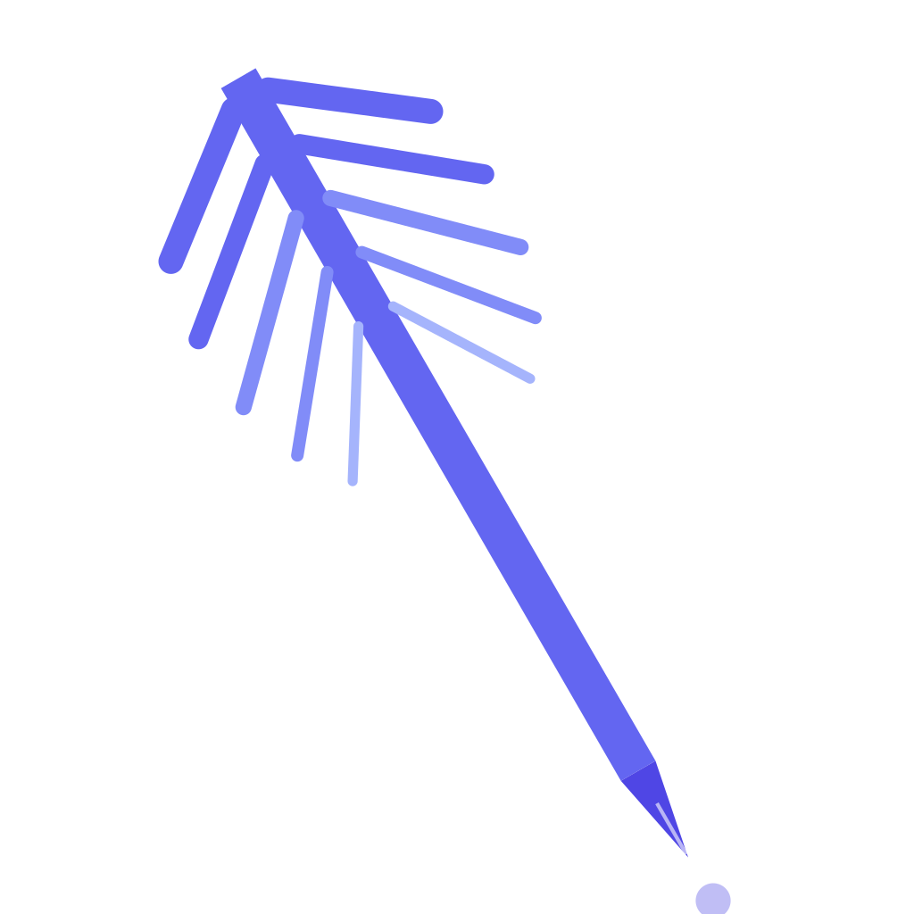

<p align="center">
  
</p>

<h1 align="center">QuillForge</h1>

<p align="center">
  <strong>AI-Powered Novel Writing Assistant</strong>
</p>

<p align="center">
  <strong>English</strong> | <a href="README_zh-CN.md">简体中文</a>
</p>

<p align="center">
  <a href="#license"></a>
  <a href="https://vuejs.org"></a>
  <a href="https://v2.tauri.app"></a>
  <a href="https://www.rust-lang.org"></a>
  <a href="https://www.typescriptlang.org"></a>
</p>

---

QuillForge is a desktop application for web novel authors, combining a rich text editor with AI-assisted writing capabilities. It supports multiple LLM providers (OpenAI, Anthropic, Ollama, and OpenAI-compatible APIs), stores all data locally with encrypted credentials, and features an inline ghost-text completion system inspired by modern code editors.

## ✨ Features

<table>
  <tr>
    <td width="50%">
      <h4>📚 Book & Chapter Management</h4>
      <p>Hierarchical organization: books → chapters, with per-book world settings, story outlines, and character profiles that serve as AI context.</p>
    </td>
    <td width="50%">
      <h4>🔍 AI Review</h4>
      <p>Select text and receive grammar, pacing, character consistency, and plot logic feedback with one click.</p>
    </td>
  </tr>
  <tr>
    <td>
      <h4>💡 Idea Generation</h4>
      <p>Describe your current plot point and get 3–5 creative directions, informed by your book's established world and characters.</p>
    </td>
    <td>
      <h4>✍️ Inline Ghost-Text Continuation</h4>
      <p>AI-generated prose appears as ghost text directly in the editor. <kbd>Tab</kbd> to accept, <kbd>Esc</kbd> to dismiss — just like IDE code completion.</p>
    </td>
  </tr>
  <tr>
    <td>
      <h4>🌍 World-Building Generator</h4>
      <p>Generate world settings and character profiles with structured AI output. Auto-parsed into editable form fields.</p>
    </td>
    <td>
      <h4>🔌 Multi-Provider Support</h4>
      <p>OpenAI · Anthropic · Ollama · OpenAI-compatible (DeepSeek, Qwen, Doubao, etc.). Save as named presets and switch from the toolbar.</p>
    </td>
  </tr>
  <tr>
    <td>
      <h4>🌐 Internationalization</h4>
      <p>Chinese (简体中文) and English. Switch on the fly from the toolbar.</p>
    </td>
    <td>
      <h4>🎨 Dark & Light Themes</h4>
      <p>One-click toggle. Follows system preference by default.</p>
    </td>
  </tr>
</table>

## 🛡️ Security

- API keys are encrypted with **AES-256-GCM** and stored in the Tauri secure store
- Keys never leave the Rust backend — the frontend only knows whether a key is configured
- All LLM HTTP requests are proxied through the Rust layer

## 🏗️ Tech Stack

| Layer | Stack |
|-------|-------|
| Desktop Shell | [Tauri 2.x](https://v2.tauri.app) |
| Frontend | [Vue 3](https://vuejs.org) + [TypeScript](https://www.typescriptlang.org) + [Vite](https://vitejs.dev) |
| State | [Pinia](https://pinia.vuejs.org) |
| Editor | [TipTap](https://tiptap.dev) (ProseMirror) |
| i18n | [vue-i18n](https://vue-i18n.intlify.dev) |
| Backend | Rust — [reqwest](https://docs.rs/reqwest), [tokio](https://tokio.rs), [aes-gcm](https://docs.rs/aes-gcm) |

## 🚀 Quick Start

### Prerequisites

- **Node.js** ≥ 18
- **Rust** ≥ 1.70
- Platform-specific [Tauri dependencies](https://v2.tauri.app/start/prerequisites/)

```bash
# Install dependencies
npm install

# Start development
npm run tauri dev

# Production build
npm run tauri build
```

## 📁 Project Structure

```
├── src/                          # Vue 3 frontend
│   ├── components/
│   │   ├── ai/                   # ReviewResult, IdeaResult, ContinueResult, AiPanel
│   │   ├── common/               # AppLayout, TitleBar, LoadingDots
│   │   ├── editor/               # NovelEditor, BookSidebar, BookSettingsPanel, CharacterPanel
│   │   └── settings/             # SettingsDialog, ProviderCard, ApiKeyInput
│   ├── stores/                   # Pinia (book, editor, settings, theme, i18n)
│   ├── commands/                 # Tauri invoke wrappers
│   ├── extensions/               # TipTap GhostText extension
│   ├── i18n/locales/             # zh-CN, en-US
│   └── types/                    # TypeScript definitions
│
├── src-tauri/                    # Rust backend
│   └── src/
│       ├── commands.rs           # Tauri commands (AI, persistence, export)
│       ├── crypto.rs             # AES-256-GCM encrypt/decrypt
│       └── llm/                  # Provider implementations (OpenAI, Anthropic, Ollama, compat)
│
├── package.json
├── vite.config.ts
└── tsconfig.json
```

## 📄 License

MIT © 2026 [oxroot](https://github.com/oxroot-crypto) & Claude

---

<p align="center">
  <sub>Built with ❤️ by oxroot & Claude</sub>
</p>
