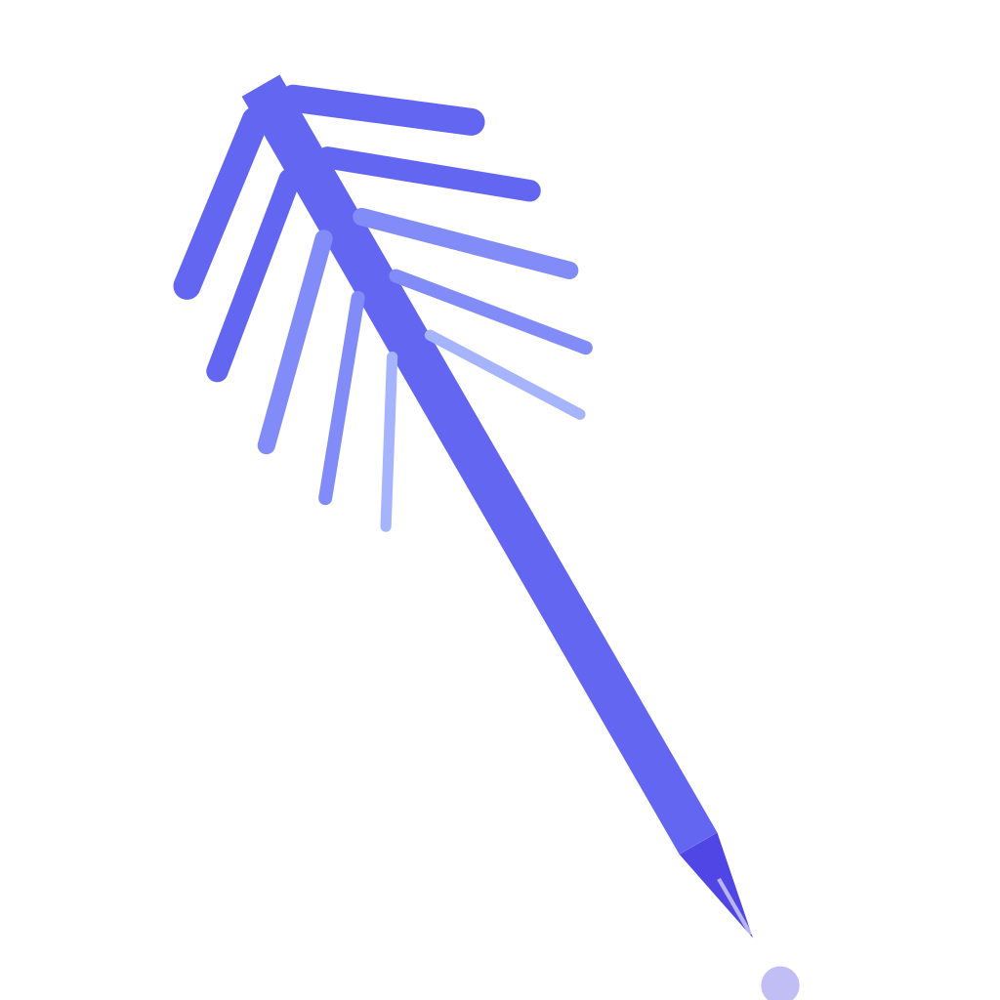

<p align="center">
  
</p>

<h1 align="center">QuillForge</h1>

<p align="center">
  <strong>AI 时代的网文锻造工坊</strong><br />
  从构思到完稿——你只需专注于创作，其余交给 QuillForge
</p>

<p align="center">
  
  
  
  
  
</p>

<p align="center">
  <sub>Built with &#x2764;&#xFE0F; by <a href="https://github.com/oxroot-crypto">oxroot</a> &amp; <a href="https://claude.ai/code">Claude Code</a></sub>
</p>

---

## &#x1F4D6; 产品理念

写作不仅是技巧，更是与灵感的博弈。QuillForge 不是替你写作的工具——它是你的**创作放大镜**，在你需要的时候出现，在你专注的时候消失。从章节大纲到角色体系，从文字润色到剧情一致，AI 作为搭档而非主宰。

---

## &#x2728; 核心能力

<table>
  <tr>
    <td width="50%">
      <h3>&#x1F4DD; 沉浸式编辑器</h3>
      <ul>
        <li>TipTap 富文本引擎，衬线字体排版，1.9 倍行距</li>
        <li><strong>专注模式</strong>——收窄编辑区，淡化一切干扰</li>
        <li>Ghost Text 幽灵续写——AI 续写以半透明提示浮现，Tab 接受，Esc 消失</li>
        <li>章节状态四态流转（草稿 → 修改中 → 已完成 → 冻结）</li>
        <li>版本快照自动备份，随时回滚到任意历史版本</li>
      </ul>
    </td>
    <td width="50%">
      <h3>&#x1F9E0; AI 辅助面板</h3>
      <ul>
        <li><strong>审阅</strong>——文法、节奏、人物塑造、情节逻辑</li>
        <li><strong>脑暴</strong>——情节创意发散，帮你突破卡文瓶颈</li>
        <li><strong>续写</strong>——光标后自动续写，细腻/紧张/对话四种风格</li>
        <li><strong>改写</strong>——古风化、悬疑增强、对话润色、节奏压缩</li>
        <li><strong>一致性</strong>——角色设定 + 大纲偏离交叉检查</li>
        <li><strong>生成章节</strong>——按设定一键生成完整章节</li>
      </ul>
    </td>
  </tr>
  <tr>
    <td width="50%">
      <h3>&#x1F916; Agents CLI <sup>v1.3.0</sup></h3>
      <ul>
        <li>自然语言驱动——<em>「创建修仙小说，设世界观，造 3 个前期角色，规划 10 章大纲」</em></li>
        <li>13 个工具——建书、世界观、角色 CRUD、大纲 CRUD、章节读写</li>
        <li>智能校验——防止 AI 凭空编造、虚假声称</li>
        <li>大纲驱动写作——生成内容严格遵循大纲设定</li>
        <li>终端风格界面，跟随亮/暗主题自动切换</li>
      </ul>
    </td>
    <td width="50%">
      <h3>&#x1F30D; 多模型 & 安全</h3>
      <ul>
        <li>OpenAI · Anthropic · Ollama · 任意 OpenAI Compatible API</li>
        <li>多预设配置，一键切换不同模型组合</li>
        <li>API Key AES-256-GCM 加密，Rust 层代理请求</li>
        <li>前端永远无法接触明文 Key</li>
        <li>所有数据本地 JSON 存储，零云端依赖</li>
      </ul>
    </td>
  </tr>
</table>

---

## &#x1F680; 快速开始

```bash
# 克隆仓库
git clone https://github.com/oxroot-crypto/QuillForge.git
cd QuillForge

# 安装依赖
npm install

# 启动 Tauri 开发环境
npm run tauri dev

# 生产构建
npm run tauri build
```

> **要求**：Node.js 18+、Rust toolchain（[rustup](https://rustup.rs)）、Tauri 系统依赖（[指南](https://v2.tauri.app/start/prerequisites/)）

---

## &#x1F3D7;&#xFE0F; 架构

```
┌─────────────┬──────────────────────────┬──────────────┐
│  TitleBar   │  自定义标题栏（无系统边框）            │
├─────────────┬──────────────────────────┬──────────────┤
│             │  EditorToolbar           │              │
│ BookSidebar │  NovelEditor (TipTap)    │   AiPanel    │
│  240px      │  + BubbleMenu 浮动工具栏  │   320px      │
│             │  + GhostText 幽灵续写     │              │
├─────────────┴──────────────────────────┤              │
│            Agents CLI (终端风格)        │              │
└────────────────────────────────────────┴──────────────┘
```

| 层级 | 技术 |
|------|------|
| 桌面框架 | Tauri 2.x + Rust |
| 前端 | Vue 3 + TypeScript + Pinia + Vite |
| 编辑器 | TipTap (ProseMirror) |
| 状态管理 | Pinia Composition API |
| 国际化 | vue-i18n（zh-CN / en-US）|
| 拼写检查 | 内嵌词库 + Levenshtein 编辑距离 |
| 全文搜索 | 内存分词索引 |
| 加密 | AES-256-GCM |

---

## &#x1F4AE; 贡献

欢迎提交 Issue 和 PR！请先阅读 [CONTRIBUTE.md](./CONTRIBUTE.md) 了解编码规范和提交约定。

---

## &#x1F4C4; License

MIT © [oxroot](https://github.com/oxroot-crypto)

---

<p align="center">
  <sub>Made with &#x2694;&#xFE0F; for storytellers. Augmented by AI, driven by human creativity.</sub>
</p>
